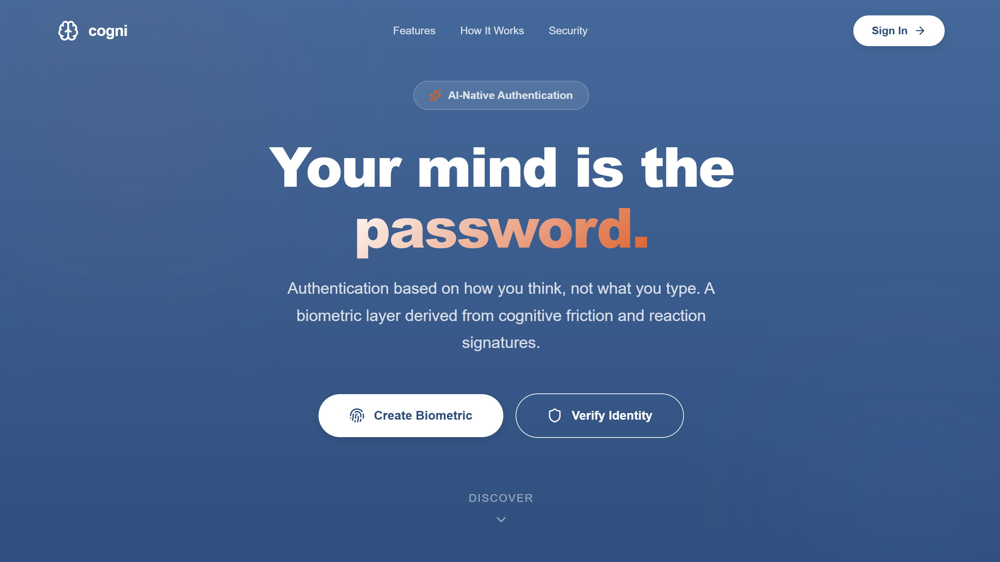
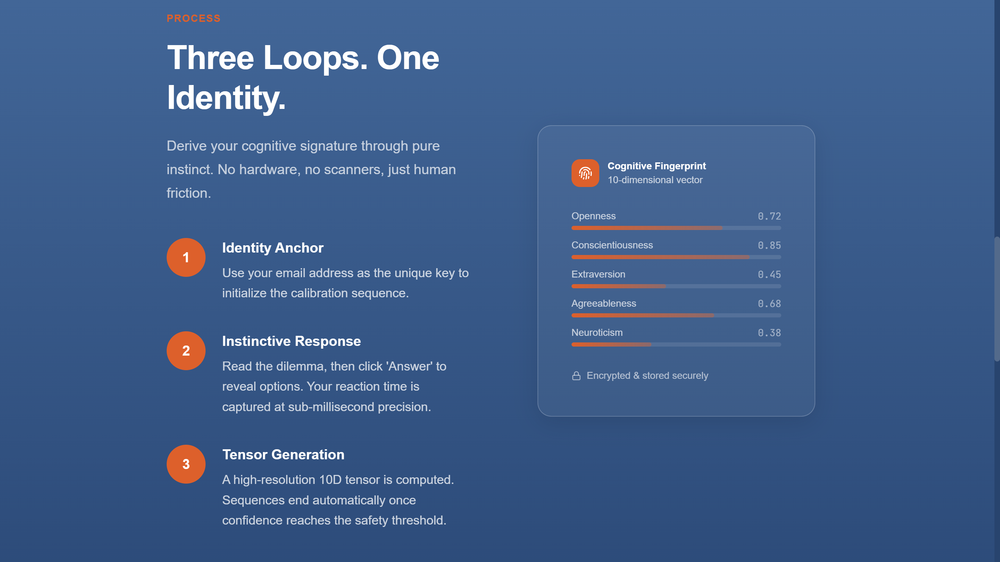
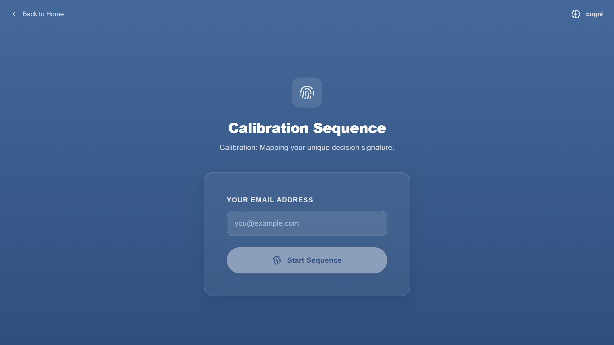
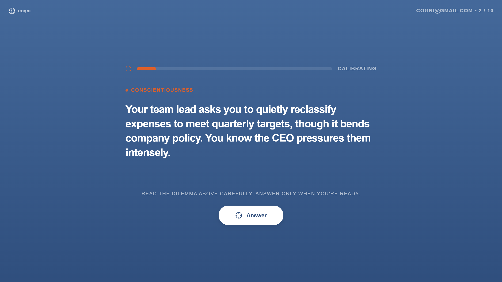
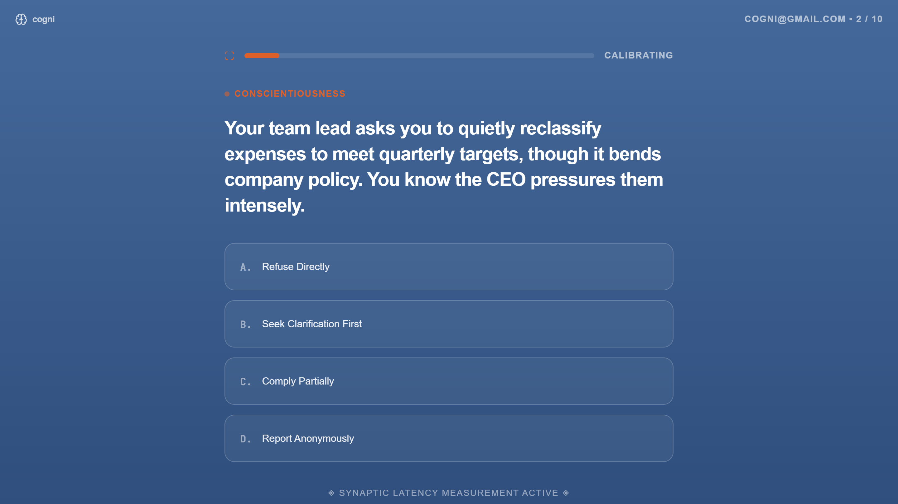

# Cogni: Psycho-Temporal Biometric Authentication

Cogni is an experimental authentication layer that verifies identity through cognitive friction rather than cryptographic keys or static biology. By mapping a user's instinctual responses to dynamic moral and pragmatic dilemmas, Cogni generates a high-resolution, mathematically verifiable biometric tensor. 

This project was built as a submission for an advanced engineering fellowship, demonstrating a novel integration of Large Language Models in security architectures.

## Interface

  
  

  
  

  

## The Core Concept

Traditional authentication relies on static data (passwords) or static physical traits (fingerprints, FaceID). Both are increasingly vulnerable to deepfakes, breaches, and AI-driven impersonation. 

Cogni introduces a dynamic biometric model: **how you think**. 
When a user attempts to authenticate, the system forces them to solve a series of highly nuanced, context-aware dilemmas. The system measures two vectors:
1. **Psychometric Vector**: The actual choices made, mapped across the Big Five (OCEAN) personality traits.
2. **Temporal Vector**: The sub-millisecond latency taken to process the dilemma and select an option.

Combined, these form a 10-dimensional tensor that is uniquely yours and virtually impossible to spoof.

## Technical Architecture

* **Framework**: Next.js 14 (App Router), React, TypeScript
* **Database**: Supabase (PostgreSQL)
* **Intelligence**: Google Gemini 2.0 Flash (with native Google Search grounding)

## Engine Mechanics

### Dynamic Dilemma Generation
Pre-computed questions are vulnerable to replay attacks. Cogni uses Gemini 2.0 Flash with live search access to generate novel, 60-day relevant dilemmas on the fly. This ensures the user is reacting to fresh stimuli every time, preventing muscle-memory bypasses.

### Flexible Multi-Trait Scoring
Every generated option is weighted across 2 to 5 relevant OCEAN traits. This dense scoring matrix ensures that even a short 3-question verification loop captures enough signal to construct a highly accurate fingerprint.

### Entropy Defense 
Automated scripts and synthetic agents operate with mathematical uniformity. Cogni calculates the statistical variance of response latencies. If the standard deviation drops below a human threshold (suspiciously consistent timing), the system triggers an automatic rejection.

### Sub-Millisecond Precision Gates
To prevent reading speed from contaminating the cognitive latency data, the UI implements an "Answer" gate. The timer begins only after the user actively engages with the dilemma and reveals the options.

## Local Setup

1. Clone the repository.
2. Install dependencies: `npm install`
3. Create a `.env.local` file with the following keys:
   * `NEXT_PUBLIC_SUPABASE_URL`
   * `NEXT_PUBLIC_SUPABASE_ANON_KEY`
   * `GEMINI_API_KEY`
4. Run the database migration script located in `setup.sql` in your Supabase SQL editor.
5. Start the development server: `npm run dev`
